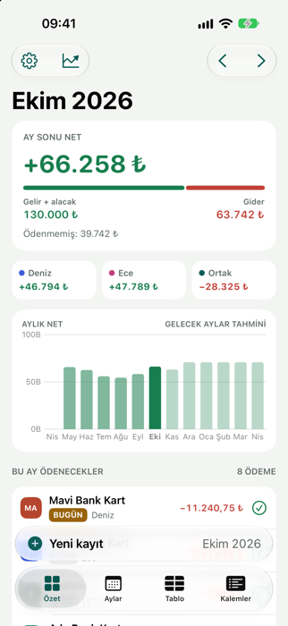
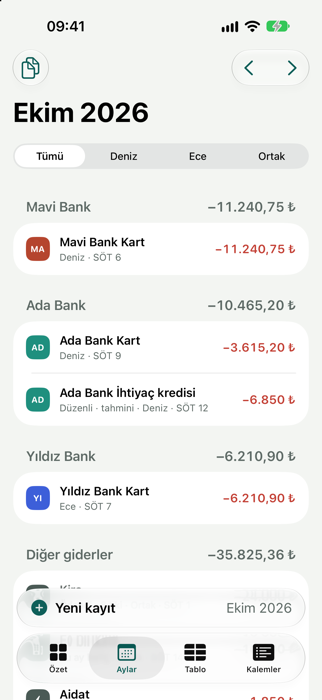
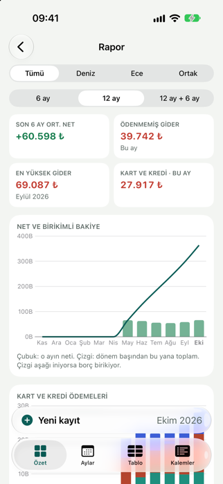
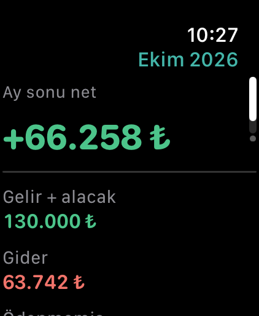
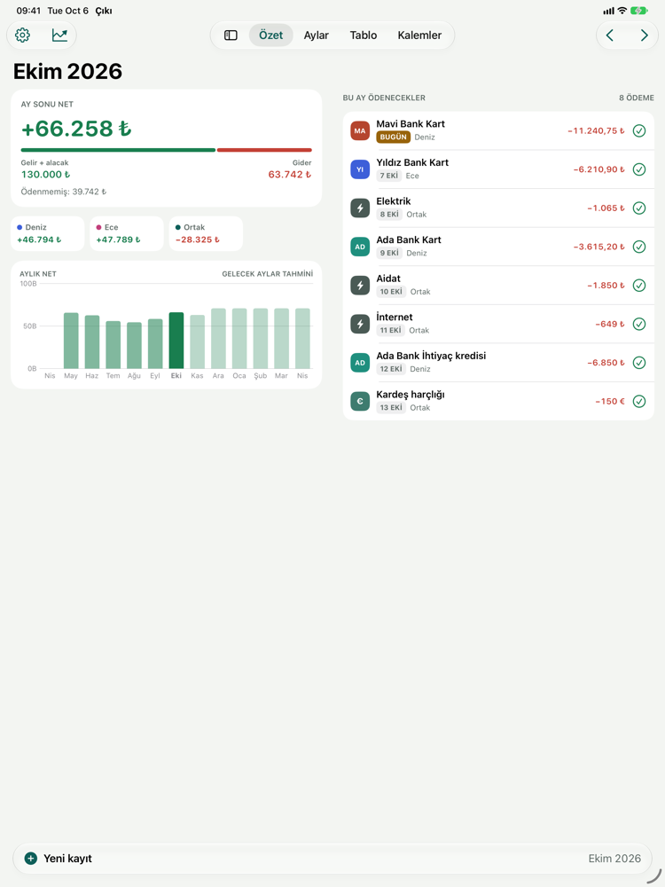
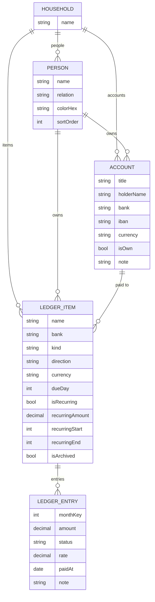

<p align="center"></p>

# Çıkı

*Çıkı: eskiden paranın bağlanıp saklandığı düğümlü mendil.*

Ortak bütçe, borç ve ödeme takibi. Excel'de tutulan aylık borç, gelir ve ödeme tablosundan doğdu. Hanedeki herkes (eş, aile, ev arkadaşları) aynı veriyi kendi telefonunda görür; geçmiş, bu ay ve gelecek aylar tek bakışta okunur.

> Teknik kimliklerde "ı" harfi kullanılamadığı için proje, hedefler ve kimlikler **Ciki** yazılır: `com.yakupad.Ciki`, `group.com.yakupad.Ciki`, `iCloud.com.yakupad.Ciki`.

<p>




</p>


- **Platform:** iPhone, iPad ve Mac (Mac Catalyst, Mac görünümü), iOS / iPadOS / macOS 27, SwiftUI. iPhone Duo'nun dış ve iç ekranına uyumlu.
- **Veri:** Core Data + NSPersistentCloudKitContainer (iCloud paylaşımına hazır)
- **Diller:** Türkçe ve İngilizce (iOS Ayarlar → Çıkı → Dil)
- **Görünüm:** Açık ve koyu mod; Ayarlar → Görünüm'den Sistem / Açık / Koyu seçilebilir.
- **Para birimleri:** TL ve TCMB'nin yayımladığı 21 döviz (USD, EUR, GBP, CHF, JPY, SAR, AED, AZN…)
- **Gösterim para birimi:** Toplamlar TL, EUR, USD ya da desteklenen herhangi bir birimde gösterilebilir (Ayarlar → Para birimi).
- **Tasarım sayfası:** [Plan, ekranlar ve palet](https://claude.ai/artifact/QEnAVyTx2Cw5UZVjPVkVHu)

## Uygulama ikonu

`Ciki/Resources/AppIcon.icon` ve `CikiWatch/AppIcon.icon`, Xcode 27.1'deki **Icon Composer** biçiminde katmanlı ikonlardır: petrol yeşili degrade zemin, büzülmüş ağzı amber bir bağla bağlanmış bohça. Cam efekti, ışık, gölge ve koyu / renklendirilmiş / şeffaf modlar sistem tarafından üretilir. Önizleme:

```sh
ictool Ciki/Resources/AppIcon.icon --export-image --output-file icon.png --platform iOS --rendition Default --width 1024 --height 1024 --scale 1
```
(`ictool`: `Xcode_27.1.app/Contents/Applications/Icon Composer.app/Contents/Executables/ictool`; `--rendition` için `Dark`, `TintedLight`, `ClearLight` da kullanılabilir.)

## Ekran boyutları

- **iPhone ve iPhone Duo dış ekranı:** tek sütun, altta sekme çubuğu.
- **iPad, Mac ve iPhone Duo iç ekranı** (geniş boyut sınıfı): kenar çubuğuna açılabilen sekmeler, iki sütunlu Özet, yan yana grafikler, okunur genişlikte listeler.
- **iPhone Duo iç ekranı:** Özet, `ArrangementView` (`.split`) ile iki bölmeye ayrılır; iOS bölmeleri katlanma çizgisinin iki yanına yerleştirir. Kitap duruşunda özet solda, ödenecekler sağda; masa üstü duruşta özet üstte, ödenecekler altta. Mac'te `ArrangementView` olmadığı için yan yana düzen kullanılır.
- Düzen pencere genişliğine göre seçilir (600 pt ve üstü iki sütun). Duo'nun iç ekranı iPhone olduğu için boyut sınıfı "dar" görünebilir; genişlik ölçüldüğü için yine iki sütunlu açılır. Duo katlanıp açıldığında ya da iPad'de bölünmüş ekranda kendiliğinden değişir.

### Apple Watch'ta test

Saat uygulaması özeti iPhone'dan alır. Simülatörde `simctl install` ile ayrı yüklenen saat uygulaması iPhone'da "yüklü" görünmez ve özet gönderilmez; eşli simülatörlerde Xcode'un Çalıştır düğmesiyle (CikiWatch şeması) ya da gerçek cihazlarla denenmelidir. Ekranları bağlantısız görmek için DEBUG'da `-sampleSnapshot` ve `-watchPage 1` argümanları vardır.

### iPhone Duo'da test

iOS 27.1 simülatöründe *iPhone Duo* kullanılır. Katlama Xcode'un Device Hub penceresindeki düğmelerle yapılır; `simctl`'de bu komut yoktur. Komut satırından denemek için [hinge](https://github.com/artemnovichkov/hinge) aracı kullanılabilir. Araç, simülatörün içinde Device Hub'ın menteşe kaydırıcısıyla aynı olayı gönderir:

```sh
hinge open    # 180°, iç ekran
hinge half    # 90°, yarım katlı
hinge close   # 0°, dış ekran
xcrun simctl io booted screenshot --display=<ekran UUID> duo.png   # ekranlar: simctl io booted enumerate
```

## Kurulum

**Xcode 27.1 gerekir** (iPhone Duo API'leri: `ArrangementView`, `DeviceHinge`). En düşük sürüm iOS / iPadOS / macOS 27.0'dır; 27.1 öncesinde Duo'ya özel düzen yerine yan yana düzen kullanılır.

```sh
brew install xcodegen      # bir kez
xcodegen generate          # project.yml değişince
open Ciki.xcodeproj
```

Testler:

```sh
xcodebuild -project Ciki.xcodeproj -scheme Ciki \
  -destination 'platform=iOS Simulator,name=iPhone 17 Pro' test
```

Debug derlemesinde **Ayarlar → Geliştirici → Örnek veriyi yükle**: kurgusal Deniz ve Ece hanesi, aylar ve ödeme günleri bugüne göre (`-loadSampleData` ilk açılış ekranını da atlar; `-onboardingStep people|privacy|invited` ilk açılışın bir adımını açar) yüklenir. Simülatörde `-loadSampleData` başlatma argümanı aynı işi açılışta yapar; `-openReport` doğrudan rapor ekranını, `-startTab 0…3` istenen sekmeyi açar.

## iCloud ile ortak kullanım kurulumu

1. Xcode → Settings → Accounts'ta Apple ID ekli olsun. Team (`D677J9K7QY`) `project.yml`'da tanımlı.
2. *iCloud* yeteneğinde `iCloud.com.yakupad.Ciki` container'ının işaretli olduğunu kontrol edin; yoksa **+** ile oluşturun.
3. Uygulamayı iki ayrı Apple ID'li iki iPhone'a yükleyin.
4. İlk telefonda **Ayarlar → iCloud ile ortak kullanım → Kişi davet et** ile daveti gönderin. Eş, anne, baba, kardeş ya da ev arkadaşı; birden fazla kişi davet edilebilir.
5. İkinci telefonda davet bağlantısını açın. O telefonda daha önce girilmiş kayıtlar varsa uygulama "ortak haneye kopyala" ya da "sil" diye sorar.
6. TestFlight ya da App Store'a göndermeden önce [CloudKit Console](https://icloud.developer.apple.com)'da şemayı *Production*'a aktarın (*Deploy Schema Changes*).

iCloud hesabı olmayan cihazda (ya da container açılmadan) uygulama yalnızca yerel olarak çalışır.


## Gizlilik

- **Toplanan veri yok.** App Store gizlilik etiketi: *Veri Toplanmıyor*. Reklam, analiz ve takip yok.
- **Veriler** cihazda (Core Data, iOS veri koruması) ve kullanıcının kendi iCloud'unda (CloudKit özel ve paylaşılan veritabanı) durur; geliştirici erişemez.
- **Tek ağ isteği:** TCMB kur dosyası (`tcmb.gov.tr`), kişisel bilgi içermez.
- **Gizlilik bildirimi:** `Ciki/Resources/PrivacyInfo.xcprivacy` ve `CikiWidget/PrivacyInfo.xcprivacy`. Takip yok, toplanan veri türü yok; UserDefaults gerekçesi `CA92.1` (uygulamanın kendi ayarları) ve `1C8F.1` (widget ile App Group).
- **Uygulama içinde:** Face ID kilidi, uygulama değiştiricide ve widget'ta tutar gizleme, bildirimde tutar gizleme, Ayarlar → Gizlilik → *Verileriniz nerede?* ve *Tüm verilerimi sil*.

## Erişilebilirlik

- **Kontrast:** Metin renkleri açık ve koyu zeminde en az 4,5:1 (WCAG AA). İkincil metinler için sistem grisi yerine `Color.ikincil` kullanılır.
- **Dynamic Type:** Tutarlar metin stillerine bağlıdır (`Font.amount`); rozetler, tablo satır ve sütunları `@ScaledMetric` ile büyür. Büyük yazıda kişi kutuları daha az sütuna iner.
- **VoiceOver:** Özet kartları tek öğe okunur; ödenecekler satırında "Ödendi olarak işaretle" eylemi; grafik çubukları ve tablo hücreleri ay, kalem ve tutarla okunur.
- **Dokunma alanları:** Simge düğmeleri en az 44 × 44 pt.
- **Denetim testleri:** `CikiUITests` her ana ekranda `performAccessibilityAudit()` çalıştırır. Cam çubukların altında ya da ekran kenarında yarım kalan öğeler ve eşiğe çok yakın bulgular uyarı olarak yazılır (`A11Y-WARN`).

## Excel'deki her şeyin uygulamadaki karşılığı

| Excel'de | Uygulamada | Ne işe yarar |
|---|---|---|
| Satır: **Banka · Kart**, **Kira**, **Konut kredisi** | **Kalem** (banka + tür veya serbest ad) | Her kalemin sahibi (hanedeki bir kişi ya da Ortak), türü, para birimi ve ödeme günü olur. |
| Sütun: **Ekim, Kasım…** | **Ay** | Ay ay ileri geri gidilir. Tablo görünümü Excel düzenini aynen gösterir. |
| Hücre: `-12345,67` | **Kayıt** (kalem + ay + tutar) | Ekstre veya taksit tutarı. Bekliyor, ödendi ve hariç olarak üç durumu vardır. |
| ~~-24000~~ (üstü çizili) | **Ödendi** | Satır sola kaydırılınca ödendi olur. Toplamlarda kalır, listede soluk görünür. |
| `-10000*0` | **Hariç tut** | Tutarı silmeden o ayın hesabından çıkarır. |
| "son ödeme tarihi" sütunu | **Ödeme günü** | Özet ekranında bu ay ödenecekler gün sırasıyla listelenir. |
| Alt notlar: **150 euro harçlık**, **20 dolar abonelik** | **Düzenli ödeme** (₺, $ veya €) | Her ay tahmini satır üretir. Döviz tutarı güncel TCMB kuruyla TL'ye çevrilir. |
| **Maaş** satırı | Gelir türünde düzenli kalem | Maaş değişince o aydan itibaren yeni tutar geçerli olur. |
| **Alacak** satırı (ör. birinden alınacak borç) | **Alacak** türü | Size ödenecek tutarlar. Gelir gibi toplanır. |
| 33. satır: aylık genel toplam | Özet kartı + 13 aylık grafik | Geçmiş aylar dolu, gelecek aylar soluk (tahmin) gösterilir. |

## Ekranlar

| Ekran | İçerik |
|---|---|
| **Özet** | Ay sonu net, gelir/gider çubuğu, kişi bazında net, 13 aylık grafik, bu ay ödenecekler (BUGÜN / GECİKTİ çipleri, tek dokunuşla ödendi). |
| **Aylar** | Bankaya göre gruplu kayıtlar. Sola kaydır: ödendi. Sağa kaydır: bu ay hariç. Kişi filtresi, "Geçen aydan kopyala". |
| **Tablo** | Excel düzeni: satırlar kalemler, sütunlar aylar. Seçili ay vurgulu, hücreye dokununca düzenleme. |
| **Kalemler** | Düzenli ödemeler, düzenli gelirler, diğer kalemler ve arşiv. Üstte USD, EUR ve kalemlerde kullanılan dövizlerin kuru; dokununca aranabilir tüm kurlar listesi açılır. Düzenle ile sürükleyerek sıralanır. |
| **Kayıt ekle** | Tutar, kalem, ay, durum, not. Geçen ay, son girilen, son 3 ay ortalaması ve düzenli tutar öneri olarak sunulur. Taksitlendir açılırsa tutar aylara bölünür. |
| **Hesaplar** (Ayarlar → Kişiler'in altında) | IBAN rehberi: kişilerin kendi hesapları ve ödeme yapılan kişi/kurumlar. Dokununca IBAN kopyalanır; alıcı adı kopyalama ve paylaşma basılı tutunca. IBAN mod-97 ile doğrulanır, TR IBAN'ında banka otomatik bulunur. Kaleme ödeme hesabı bağlanırsa kayıt ekranında IBAN tek dokunuşla kopyalanır. |
| **İlk açılış** | Tanıtım, hane adı ve kişiler, Face ID kilidi ve hatırlatma tercihi. "Bir davet aldım" seçeneği kişi oluşturmadan geçer ve davet bağlantısını bekler. Verisi olan kurulumlarda gösterilmez. |
| **Rapor** | Özet'ten açılır. Son 6 ay ortalama net, ödenmemiş gider, en yüksek gider ayı; net ve birikimli bakiye grafiği; bankaya göre kart ve kredi ödemeleri; ay ay tablo. |
| **Widget** | Ana ekran (küçük, orta) ve kilit ekranı. Ay sonu net ve sıradaki ödemeler. Uygulama kilidi açıksa tutarları göstermez. |
| **Apple Watch** | Özet (ay sonu net, gelir, gider, ödenmemiş) ve sıradaki ödemeler; ödeme "Ödendi" işaretlenip iPhone'a gönderilir. Kadran komplikasyonları: sıradaki ödeme ve ayın neti. iPhone'da kilit açıksa tutarlar gizlenir. |
| **Ayarlar** | Hane adı, kişi adları ve renkleri, kur bilgisi. |

### Etkileşim ilkeleri

- **Yeni kayıt tek yerden eklenir:** sekme çubuğunun üstündeki "Yeni kayıt" çubuğu her sekmede aynı yerdedir ve seçili ay için kayıt açar. Kaydırınca sekme çubuğuyla birlikte küçülür.
- Kalem (kart, kredi, maaş…) Kalemler sekmesinden ya da kayıt ekranındaki "Yeni kalem oluştur" ile eklenir.
- Sola kaydır: ödendi. Sağa kaydır: bu ay hariç. İkisi de geri alınabilir.
- Düzenli kalemler kayıt girilene kadar "tahmini" görünür; elle girilen tutar her zaman önceliklidir.
- "Geçen aydan kopyala" ekstre satırlarını yeni aya taşır.
- Tüm tutarlar sabit genişlikli rakamlarla yazılır, sütunlar hizalı kalır.

## CloudKit şeması

Uygulama iCloud'a ilk kez yazdığında kayıt tipleri **Development** ortamında oluşur. Mağaza sürümleri ise **Production** ortamını kullanır. Model her değiştiğinde:

1. İmzalı bir DEBUG derlemesini `-initializeCloudKitSchema` argümanıyla çalıştırın. Bu argüman tüm kayıt tiplerini Development şemasına yazar. Mac'te `open -n Ciki.app --args -initializeCloudKitSchema` kullanın; doğrudan çalıştırılan ikili, argümanları kaybederek yeniden başlatılır.
2. [CloudKit Console](https://icloud.developer.apple.com/) → `iCloud.com.yakupad.Ciki` → **Deploy Schema Changes** ile Production'a aktarın.

Production'a eklenen alanlar ve tipler sonradan silinemez; yalnızca yeni alan eklenebilir.

## App Store sayfası

`AppStore/` klasöründe mağaza için gereken her şey var:

- `metadata/`: Türkçe ve İngilizce metinler
- `screenshots/`: tüm cihazlar için başlıklı ekran görüntüleri
- `creative/`: Asset Library görselleri (ürün sayfası başlığı, arama sonucu, evrensel görsel)
- `asset-library.json`: tüm görsellerin listesi
- `strategy.md`: özel ürün sayfası (CPP) ve ürün sayfası optimizasyonu (PPO) planı

Görseller `AppStore/tools/` altındaki betiklerle yeniden üretilir. Hepsi **kurgusal örnek hane** (Deniz ve Ece) ile alınır, gerçek kişisel veri kullanılmaz. Mac görüntüleri için DEBUG derlemesine `-macWindowSize 1280x800` verilir.

## Tasarım

### Palet

| Rol | Açık | Koyu | Kullanım |
|---|---|---|---|
| Petrol | `#0E5F59` | `#43B5A9` | Marka, seçili sekme, ana düğme |
| Gelir | `#1C8A57` | `#4CC48A` | Maaş, alacak, pozitif net |
| Gider | `#CF4438` | `#F0736A` | Borç, ekstre, negatif net |
| Yaklaşan | `#D98E10` | `#F0B04A` | Son ödeme bugün |
| Ödendi | `#8C9692` | `#6E7C78` | Üstü çizili, soluk satır |
| Kişi 1 | `#3D5FD9` | | Kişi rengi (Ayarlar'dan değiştirilebilir) |
| Kişi 2 | `#C23F7B` | | Kişi rengi (Ayarlar'dan değiştirilebilir) |
| Zemin | `#F3F5F2` | `#0D1312` | Yeşile çalan nötr gri |

Renkler `Ciki/Design/Theme.swift` içinde tanımlıdır.

### Tipografi

- Metinler SF Pro, tutarlar SF Pro Rounded ve `monospacedDigit()`.
- Büyük tutar: 34 pt bold rounded. Satır başlığı: subheadline semibold. Alt bilgi: caption, ikincil renk.
- Dynamic Type desteklenir.

## Mimari

### Veri modeli



- **Household (Hane):** tek kayıt. Hane üyeleriyle (eş, aile, ev arkadaşları) paylaşılan kök nesne.
- **Person (Kişi):** Hanedeki kişiler (sınırsız). İsteğe bağlı yakınlık etiketi: Eş, Anne, Baba, Kardeş, Çocuk, Akraba, Arkadaş, Ev arkadaşı, Diğer; yalnızca gösterim içindir. Sahibi olmayan kalem "Ortak" sayılır.
- **LedgerItem (Kalem):** kart, nakit avans, kredi, kira, konut taksidi, maaş, alacak, aile gönderimi vb. Düzenliyse aylık tutar ve başlangıç/bitiş ayı taşır.
- **Account (Hesap):** IBAN rehberi kaydı. `isOwn` ailenin kendi hesabı mı yoksa ödeme yapılan kişi/kurum mu olduğunu belirtir. Kalemler `payee` ile bir hesaba bağlanabilir.
- **Değişiklik kaydı.** Her telefon için "Bu telefonu kullanan" kişi seçilir (cihaza özel). Kayıt ve kalem değişikliklerinde `updatedBy` ve `updatedAt` yazılır.
- **LedgerEntry (Kayıt):** bir kalemin bir aydaki tutarı ve durumu. `monthKey = yıl × 12 + (ay − 1)`.

### Teknik kararlar

- **İki depo.** `Ciki.sqlite` kendi verilerimizi iCloud özel veritabanında, `Ciki-shared.sqlite` başkasının paylaştığı haneyi paylaşılan veritabanında tutar. Depolar arası ilişki kurulamadığı için yeni kayıtlar `place(_:in:)` ile hanenin bulunduğu depoya yazılır.
- **Etkin hane.** Paylaşılan hane varsa o, yoksa en eski yerel hane. iCloud'dan gelen değişikliklerden sonra `HouseholdSync` fazladan haneleri birleştirir.
- **Core Data + NSPersistentCloudKitContainer.** iOS 27 SDK'sında SwiftData yalnızca özel (private) iCloud veritabanını destekliyor. Başkalarıyla ortak kullanım için CKShare gerekiyor, bu yüzden Core Data seçildi. Tüm öznitelikler isteğe bağlı, benzersizlik kısıtı yok (CloudKit şartı).
- **Model sürümleri.** Veri modeli sürümlüdür (`Ciki 4.xcdatamodel` güncel; 1. sürümden taşıma test edilir). Yeni alanlar yeni sürümle eklenir, mevcut veriler otomatik (lightweight) taşınır.
- **Banka adları** büyük/küçük harf ve boşluk farkı yok sayılarak eşleştirilir; bilinen bankalar listedeki yazımla gösterilir.
- **Tutarlar `Decimal`.** Kuruş yuvarlama hatası olmaz. Taksit bölmede artan kuruşlar son taksite eklenir.
- **Gösterim para birimi.** TCMB kurları TL karşılığı olarak gelir; TL ara birimdir. Gösterim birimi TL değilse çapraz kurla çevrilir (ör. USD → EUR = USD/TL ÷ EUR/TL). Seçim cihaza özeldir, her kişi kendi telefonunda farklı birim seçebilir. Ödenmiş döviz kayıtlarının TL karşılığı ödeme günündeki kurla sabittir.
- **Döviz.** Ödenmemiş kayıtlar güncel kurla, ödenmiş kayıtlar ödeme günündeki kurla TL'ye çevrilir. Kaynak: `https://www.tcmb.gov.tr/kurlar/today.xml`. Döviz satış kuru kullanılır, yayımlanmayan birimlerde efektif satış. JPY gibi 100 birimlik kurlar bire indirilir. Çevrimdışıyken son alınan kurlar kullanılır.
- **Yerelleştirme.** Metinler `Localizable.xcstrings` (kaynak dil Türkçe) içinde. Tutar ve tarih biçimi uygulama diline göre: Türkçe `12.345,67`, İngilizce `12,345.67`.
- **Kilit.** Face ID / Touch ID / cihaz parolası (`LocalAuthentication`). Kilit ekranı ayrı bir `UIWindow`'da gösterilir; açık sayfalar da uygulama değiştiricide gizlenir.
- **Hatırlatmalar.** Bu ay ve sonraki iki ayın bekleyen, son ödeme günü olan giderleri için yerel bildirim (en fazla 60). Her kayıt değişikliğinde yeniden planlanır.
- **Widget.** Uygulama bu ayın özetini `group.com.yakupad.Ciki` App Group'una JSON olarak yazar; widget yalnızca bu özeti okur, veri tabanına erişmez. Gerçek cihazda App Group için Xcode'da Team seçili olmalıdır.
- **Apple Watch.** iPhone, widget özetini WatchConnectivity ile saate gönderir (`updateApplicationContext`); saat bunu kendi App Group'una yazar, komplikasyonlar oradan okur. Saatteki "Ödendi" işareti iPhone yakındaysa anında (`sendMessage`), değilse kuyruğa alınarak (`transferUserInfo`) iletilir; iPhone kaydı ödendi yapar ve yeni özeti geri gönderir. Mac Catalyst derlemesine Watch uygulaması gömülmez.
- **CSV.** Türkçede `;` ayraç ve `,` ondalık, İngilizcede `,` ve `.`. Excel'in Türkçe karakterleri tanıması için UTF-8 BOM eklenir.
- **Swift 6, varsayılan MainActor izolasyonu.** Core Data alt sınıfları `nonisolated`.

### Hesaplama kuralları

- **Ay neti** = gelir + alacak − gider. "Hariç" kayıtlar sayılmaz.
- **Ödendi** kayıtlar toplamda kalır (Excel'deki üstü çizili hücreler gibi).
- **Gelecek aylar** düzenli kalemlerden otomatik dolar; elle girilen kayıt önceliklidir.
- **Kur yoksa** döviz satırı toplama girmez ve özet ekranında uyarı gösterilir.

### Klasör yapısı

```
Ciki/
  App/            Uygulama girişi, sekmeler, AppState
  Model/          Core Data modeli, Month, enum'lar
  Persistence/    PersistenceController, kayıt işlemleri, örnek veri
  Domain/         Ledger (hesaplama), Money (biçimlendirme), RateService (TCMB)
  Design/         Renkler, ortak bileşenler
  Shared/         Uygulama ve widget'ın ortak kullandığı özet modeli
  Features/       Summary, Month, Grid, Items, Accounts, Entry, Report, Settings
CikiWidget/   Widget eklentisi (WidgetKit)
CikiWatch/    Apple Watch uygulaması
CikiWatchWidget/  Saat kadranı komplikasyonları
CikiTests/    Hesaplama, kur, IBAN, hatırlatma, CSV ve rapor testleri
```

## Yol haritası

### Aşama 1 · Temel ✅
- [x] Xcode projesi (XcodeGen)
- [x] Core Data modeli
- [x] Kişi ve kalem yönetimi
- [x] Aylar ekranı ve kaydırma eylemleri
- [x] Kayıt ekleme ve taksitlendirme
- [x] Özet ekranı ve 13 aylık grafik
- [x] Tablo (Excel) görünümü
- [x] Düzenli ödemeler ve TCMB kuru
- [x] Geçen aydan kopyala

### Aşama 2 · Kullanım kolaylığı ✅
- [x] Kalem sıralamasını sürükleyerek değiştirme
- [x] Kalemin geçmiş tutarlarından hızlı öneri
- [x] Ay ay toplam ve borç seyri raporu

### Aşama 3 · Ortak kullanım
- [x] CloudKit yetkileri ve iki depo (özel + paylaşılan)
- [x] iCloud eşitleme
- [x] Haneyi bir ya da birden fazla kişiyle paylaşma (CKShare, `UICloudSharingController`)
- [x] Daveti kabul etme, yerel kayıtları ortak haneye kopyalama ya da silme
- [x] Aynı Apple ID'li ikinci cihazda oluşan fazladan haneyi birleştirme
- [ ] CloudKit container'ının hesapta açılması ve iki cihazla uçtan uca deneme
- [x] Kim, neyi değiştirdi bilgisi (Ayarlar → Son değişiklikler)

### Aşama 4 · Cila ✅
- [x] Son ödeme gününden önce bildirim
- [x] Ana ekran ve kilit ekranı widget'ı
- [x] Face ID kilidi ve uygulama değiştiricide tutar gizleme
- [x] CSV dışa aktarma (kayıt listesi ve Excel düzeninde aylık tablo)
