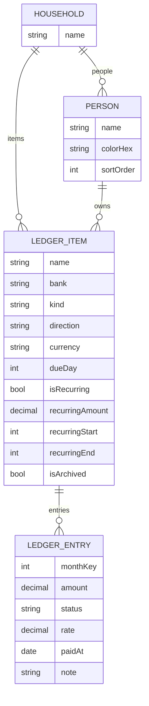

<p align="center"></p>

# Aile Kasası

Excel'de tutulan aylık borç, gelir ve ödeme tablosunun iPhone uygulaması. Deniz ve Ece aynı veriyi kendi telefonlarında görür. Geçmiş, bu ay ve gelecek aylar tek bakışta okunur.


- **Platform:** iOS 27, SwiftUI
- **Veri:** Core Data + NSPersistentCloudKitContainer (iCloud paylaşımına hazır)
- **Para birimleri:** ₺, $, € (TCMB günlük kuru)
- **Tasarım sayfası:** [Plan, ekranlar ve palet](https://claude.ai/artifact/QEnAVyTx2Cw5UZVjPVkVHu)

## Kurulum

```sh
brew install xcodegen      # bir kez
xcodegen generate          # project.yml değişince
open AileKasa.xcodeproj
```

Testler:

```sh
xcodebuild -project AileKasa.xcodeproj -scheme AileKasa \
  -destination 'platform=iOS Simulator,name=iPhone 17 Pro' test
```

Debug derlemesinde **Ayarlar → Geliştirici → Excel örnek verisini yükle** ile Ağustos–Kasım 2026 örnek verisi yüklenir. Simülatörde `-loadSampleData` başlatma argümanı aynı işi açılışta yapar; `-openReport` doğrudan rapor ekranını açar.

## Excel'deki her şeyin uygulamadaki karşılığı

| Excel'de | Uygulamada | Ne işe yarar |
|---|---|---|
| Satır: **YapıKredi · Kart**, **Kira**, **Konut** | **Kalem** (banka + tür veya serbest ad) | Her kalemin sahibi (Deniz, Ece veya Ortak), türü, para birimi ve ödeme günü olur. |
| Sütun: **Ekim, Kasım…** | **Ay** | Ay ay ileri geri gidilir. Tablo görünümü Excel düzenini aynen gösterir. |
| Hücre: `-18989` | **Kayıt** (kalem + ay + tutar) | Ekstre veya taksit tutarı. Bekliyor, ödendi ve hariç olarak üç durumu vardır. |
| ~~-48986~~ (üstü çizili) | **Ödendi** | Satır sola kaydırılınca ödendi olur. Toplamlarda kalır, listede soluk görünür. |
| `-47875*0` | **Hariç tut** | Tutarı silmeden o ayın hesabından çıkarır. |
| "son ödeme tarihi" sütunu | **Ödeme günü** | Özet ekranında bu ay ödenecekler gün sırasıyla listelenir. |
| Alt notlar: **52319 euro harçlık**, **300 harçlık**, **20 dolar** | **Düzenli ödeme** (₺, $ veya €) | Her ay tahmini satır üretir. Döviz tutarı güncel TCMB kuruyla TL'ye çevrilir. |
| **Maaş** satırı | Gelir türünde düzenli kalem | Maaş değişince o aydan itibaren yeni tutar geçerli olur. |
| **Alacak** satırı | **Alacak** türü | Size ödenecek tutarlar. Gelir gibi toplanır. |
| 33. satır: aylık genel toplam | Özet kartı + 13 aylık grafik | Geçmiş aylar dolu, gelecek aylar soluk (tahmin) gösterilir. |

## Ekranlar

| Ekran | İçerik |
|---|---|
| **Özet** | Ay sonu net, gelir/gider çubuğu, kişi bazında net, 13 aylık grafik, bu ay ödenecekler (BUGÜN / GECİKTİ çipleri, tek dokunuşla ödendi). |
| **Aylar** | Bankaya göre gruplu kayıtlar. Sola kaydır: ödendi. Sağa kaydır: bu ay hariç. Kişi filtresi, "Geçen aydan kopyala". |
| **Tablo** | Excel düzeni: satırlar kalemler, sütunlar aylar. Seçili ay vurgulu, hücreye dokununca düzenleme. |
| **Kalemler** | Düzenli ödemeler, düzenli gelirler, diğer kalemler ve arşiv. Üstte güncel döviz kuru. Düzenle ile sürükleyerek sıralanır. |
| **Kayıt ekle** | Tutar, kalem, ay, durum, not. Geçen ay, son girilen, son 3 ay ortalaması ve düzenli tutar öneri olarak sunulur. Taksitlendir açılırsa tutar aylara bölünür. |
| **Rapor** | Özet'ten açılır. Son 6 ay ortalama net, ödenmemiş gider, en yüksek gider ayı; net ve birikimli bakiye grafiği; bankaya göre kart ve kredi ödemeleri; ay ay tablo. |
| **Ayarlar** | Hane adı, kişi adları ve renkleri, kur bilgisi. |

### Etkileşim ilkeleri

- Sola kaydır: ödendi. Sağa kaydır: bu ay hariç. İkisi de geri alınabilir.
- Düzenli kalemler kayıt girilene kadar "tahmini" görünür; elle girilen tutar her zaman önceliklidir.
- "Geçen aydan kopyala" ekstre satırlarını yeni aya taşır.
- Tüm tutarlar sabit genişlikli rakamlarla yazılır, sütunlar hizalı kalır.

## Tasarım

### Palet

| Rol | Açık | Koyu | Kullanım |
|---|---|---|---|
| Petrol | `#0E5F59` | `#43B5A9` | Marka, seçili sekme, ana düğme |
| Gelir | `#1C8A57` | `#4CC48A` | Maaş, alacak, pozitif net |
| Gider | `#CF4438` | `#F0736A` | Borç, ekstre, negatif net |
| Yaklaşan | `#D98E10` | `#F0B04A` | Son ödeme bugün |
| Ödendi | `#8C9692` | `#6E7C78` | Üstü çizili, soluk satır |
| Deniz | `#3D5FD9` | | Kişi rengi (Ayarlar'dan değiştirilebilir) |
| Ece | `#C23F7B` | | Kişi rengi (Ayarlar'dan değiştirilebilir) |
| Zemin | `#F3F5F2` | `#0D1312` | Yeşile çalan nötr gri |

Renkler `AileKasa/Design/Theme.swift` içinde tanımlıdır.

### Tipografi

- Metinler SF Pro, tutarlar SF Pro Rounded ve `monospacedDigit()`.
- Büyük tutar: 34 pt bold rounded. Satır başlığı: subheadline semibold. Alt bilgi: caption, ikincil renk.
- Dynamic Type desteklenir.

## Mimari

### Veri modeli



- **Household (Hane):** tek kayıt. İleride eşle paylaşılan kök nesne.
- **Person (Kişi):** Deniz ve Ece. Sahibi olmayan kalem "Ortak" sayılır.
- **LedgerItem (Kalem):** kart, nakit avans, kredi, kira, konut taksidi, maaş, alacak, aile gönderimi vb. Düzenliyse aylık tutar ve başlangıç/bitiş ayı taşır.
- **LedgerEntry (Kayıt):** bir kalemin bir aydaki tutarı ve durumu. `monthKey = yıl × 12 + (ay − 1)`.

### Teknik kararlar

- **Core Data + NSPersistentCloudKitContainer.** iOS 27 SDK'sında SwiftData yalnızca özel (private) iCloud veritabanını destekliyor. Eşle ortak kullanım için CKShare gerekiyor, bu yüzden Core Data seçildi. Tüm öznitelikler isteğe bağlı, benzersizlik kısıtı yok (CloudKit şartı).
- **Tutarlar `Decimal`.** Kuruş yuvarlama hatası olmaz. Taksit bölmede artan kuruşlar son taksite eklenir.
- **Döviz.** Ödenmemiş kayıtlar güncel kurla, ödenmiş kayıtlar ödeme günündeki kurla TL'ye çevrilir. Kaynak: `https://www.tcmb.gov.tr/kurlar/today.xml` (döviz satış). Çevrimdışıyken son alınan kur kullanılır.
- **Swift 6, varsayılan MainActor izolasyonu.** Core Data alt sınıfları `nonisolated`.

### Hesaplama kuralları

- **Ay neti** = gelir + alacak − gider. "Hariç" kayıtlar sayılmaz.
- **Ödendi** kayıtlar toplamda kalır (Excel'deki üstü çizili hücreler gibi).
- **Gelecek aylar** düzenli kalemlerden otomatik dolar; elle girilen kayıt önceliklidir.
- **Kur yoksa** döviz satırı toplama girmez ve özet ekranında uyarı gösterilir.

### Klasör yapısı

```
AileKasa/
  App/            Uygulama girişi, sekmeler, AppState
  Model/          Core Data modeli, Month, enum'lar
  Persistence/    PersistenceController, kayıt işlemleri, örnek veri
  Domain/         Ledger (hesaplama), Money (biçimlendirme), RateService (TCMB)
  Design/         Renkler, ortak bileşenler
  Features/       Summary, Month, Grid, Items, Entry, Report, Settings
AileKasaTests/    Hesaplama, taksit, kur, öneri, sıralama ve rapor testleri
```

## Yol haritası

### Aşama 1 · Temel ✅
- [x] Xcode projesi (XcodeGen)
- [x] Core Data modeli
- [x] Kişi ve kalem yönetimi
- [x] Aylar ekranı ve kaydırma eylemleri
- [x] Kayıt ekleme ve taksitlendirme
- [x] Özet ekranı ve 13 aylık grafik
- [x] Tablo (Excel) görünümü
- [x] Düzenli ödemeler ve TCMB kuru
- [x] Geçen aydan kopyala

### Aşama 2 · Kullanım kolaylığı ✅
- [x] Kalem sıralamasını sürükleyerek değiştirme
- [x] Kalemin geçmiş tutarlarından hızlı öneri
- [x] Ay ay toplam ve borç seyri raporu

### Aşama 3 · Ortak kullanım
- [ ] CloudKit container (`iCloud.com.yakupad.AileKasa`) ve yetkiler
- [ ] iCloud eşitleme
- [ ] Haneyi eşle paylaşma (CKShare)
- [ ] Kim, neyi değiştirdi bilgisi
- [ ] Çakışma testleri

### Aşama 4 · Cila
- [ ] Son ödeme gününden önce bildirim
- [ ] Ana ekran widget'ı
- [ ] Face ID kilidi ve uygulama değiştiricide tutar gizleme
- [ ] CSV dışa aktarma
